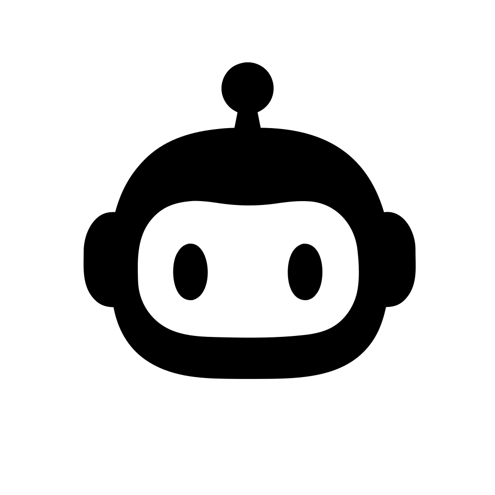

# RunBot 

> GitHub Actions, local runners, and AI failure recovery — in your macOS menu bar.

**Platform & Stack**


**CI Checks**


[](https://github.com/runbot-hq/run-bot/actions/workflows/codeql.yml)

**AI Reviewers**

[](https://greptile.com)
[](https://coderabbit.ai)
[](https://octopusreview.com)

**Code Quality**

[](https://sonarcloud.io/summary/new_code?id=eoncode_runner-bar)
[](https://sonarcloud.io/summary/new_code?id=eoncode_runner-bar)
[](https://sonarcloud.io/summary/new_code?id=eoncode_runner-bar)
[](https://sonarcloud.io/summary/new_code?id=eoncode_runner-bar)
[](https://sonarcloud.io/summary/new_code?id=eoncode_runner-bar)
[](https://sonarcloud.io/summary/new_code?id=eoncode_runner-bar)
[](https://sonarcloud.io/summary/new_code?id=eoncode_runner-bar)
[](https://sonarcloud.io/summary/new_code?id=eoncode_runner-bar)
[](https://sonarcloud.io/summary/new_code?id=eoncode_runner-bar)
[](https://sonarcloud.io/summary/new_code?id=eoncode_runner-bar)

**Activity**

[](https://github.com/runbot-hq/run-bot/releases/latest)
[](https://github.com/runbot-hq/run-bot/releases)
[](https://github.com/runbot-hq/run-bot/releases)
[](https://github.com/runbot-hq/run-bot/releases/latest)
[](https://github.com/runbot-hq/run-bot/pulls)
[](https://github.com/runbot-hq/run-bot/pulls?q=is%3Apr+is%3Aclosed)
[](https://github.com/runbot-hq/run-bot/issues)
[](https://github.com/runbot-hq/run-bot/issues?q=is%3Aissue+is%3Aclosed)

---

## Features

**🚦 Workflow status**
- Live run status across all your repos and orgs — expand any run into a full **Workflow → Jobs → Steps** tree with elapsed time and live progress
- Drill into jobs and steps; copy logs at the workflow, job, or step level
- Re-run all, re-run failed jobs, or cancel directly from the panel or right-click context menu
- Right-click a run to open the workflow or commit on GitHub

**🏃 Local runner manager**
- Provision new runners in one click — the app handles the token, the install script, and the registration with GitHub
- Add pre-existing runners already on your Mac
- Start, stop, and deregister runners directly from the UI — no Terminal or github.com required
- Active runners show live **CPU & memory** badges while a job is in progress

**🪝 Failure hooks**
- When a run fails, automatically fire a custom shell command in Terminal
- Tokens substituted before the command runs: `$SCOPE`, `$LOCAL_PATH`, `$BRANCH`, `$RUN_ID`, `$COMMIT_SHA`, `$WORKFLOW_NAME`, `$FAILURE_LOG`, `$RUN_LINK`, `$COMMIT_LINK`, `$BRANCH_LINK`, `$REPO_LINK`
- Works with any AI CLI — Claude Code, Gemini, Aider, Codex, or anything that accepts terminal input
- Configurable per repo or org; optionally filter by branch
- **Test** button fires the command immediately from the settings sheet

---

## Install

```bash
curl -fsSL https://runbot-hq.github.io/run-bot/install.sh | bash
```

---

## Docs

- [Development](docs/development.md) — build and run locally
- [Releasing](docs/releasing.md) — release pipeline and update flow
- [Testing](docs/testing.md) — test strategy and running tests
- [Contributing](docs/contributing.md) — contribution guidelines
- [Architecture](docs/architecture.md) — data model, concurrency model, regression guards
- [Principles](docs/principles.md) — engineering and design principles
- [Privacy](docs/privacy.md) — OAuth scopes, token storage, data handling
- [Agents](AGENTS.md) — context for AI coding agents

---

## External Dependencies

- **[AppUpdater](https://github.com/runbot-hq/AppUpdater)** (first-party) — headless auto-update library; polls GitHub Releases for new versions, verifies SHA-256 integrity, and hands update state to the host app via `UpdateStateProviding`
- **[GitHubClient](https://github.com/runbot-hq/GitHubClient)** (first-party) — lightweight GitHub REST client; OAuth Authorization Code flow, layered token resolution (Keychain → env var), paginated API calls, and rate-limit handling; currently embedded as a local SPM target and extracted to its own repo as part of the ongoing modularisation effort
- **[swift-collections](https://github.com/apple/swift-collections)** (Apple) — ordered and efficient collection types used internally in `RunBotCore`; primarily `OrderedDictionary` for stable, insertion-ordered workflow state

---

## Concurrency

RunBot uses Swift 6.2 strict concurrency, so data-race safety is guaranteed by the compiler rather than by convention. UI runs on the main actor and background work is isolated in dedicated actors, all coordinated through structured `async`/`await`.

→ [`docs/architecture.md`](docs/architecture.md)

---

## Module Separation

Logic is kept independent of the app runtime: the `RunBotCore` library holds the platform-agnostic business logic, and the `RunBot` executable holds the macOS app shell. The compiler enforces the boundary, which keeps Core reusable and unit-testable with plain `swift test`.

→ [`docs/architecture.md`](docs/architecture.md)

---

## Model Philosophy

State is immutable by default and flows one way: domain models are value types, and the UI observes a single read model it never writes to. Configuration is typed and behaviour is expressed as dependency-injected use-cases, so everything stays testable in isolation.

→ [`docs/architecture.md`](docs/architecture.md) · [`docs/principles.md`](docs/principles.md)

---

**Test a branch:**
```bash
git fetch && git checkout feature/your-branch && git pull
bash build.sh && pkill RunBot; sleep 1 && open dist/RunBot.app
```
  
**Deploy release or beta:**  
- [publish.yml](https://github.com/runbot-hq/run-bot/actions/workflows/publish.yml)
- select dry_run false or true and
- select beta or release
- Tag will be bumped according to rollover rules v1.0.9 -> v1.1.0 etc
- Version will be updated in app config files
- Beta will match release version and append its own integer v1.0.2 beta-4 etc
- Dry run and test ew functinality with beta before deploying an official release
- Users toggle beta in the app prefs  
